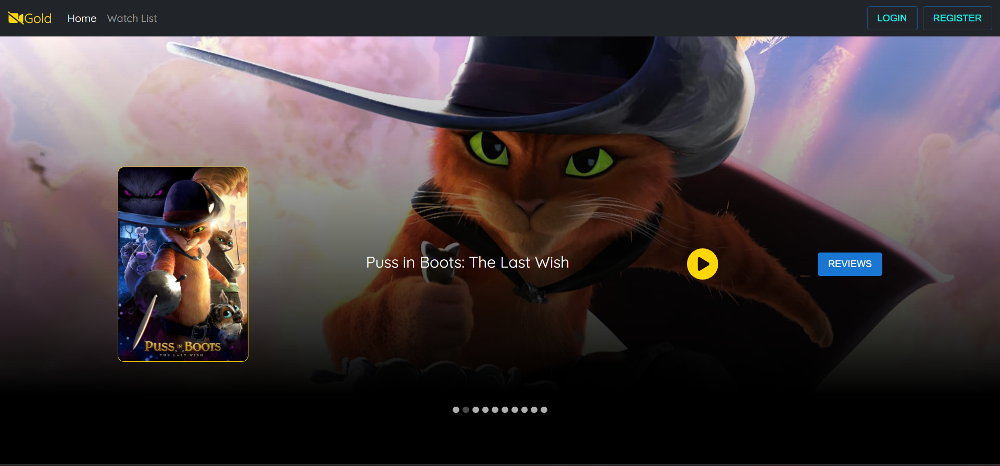
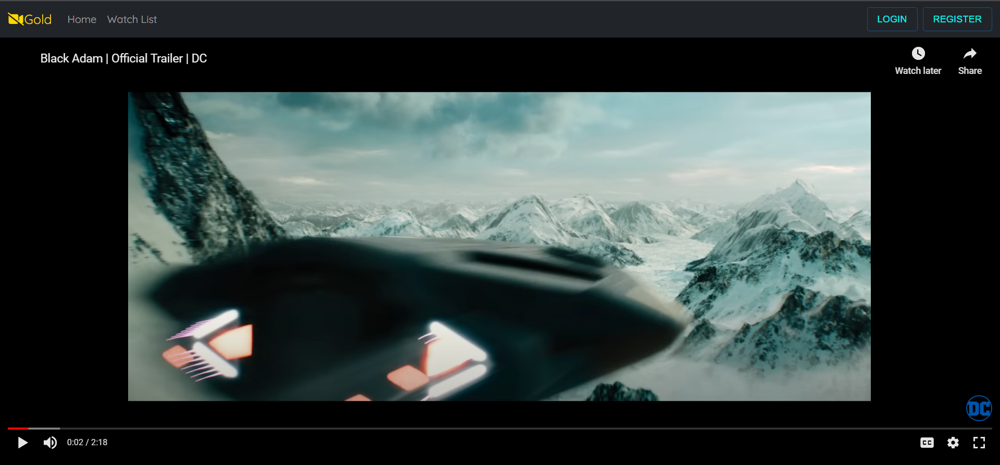
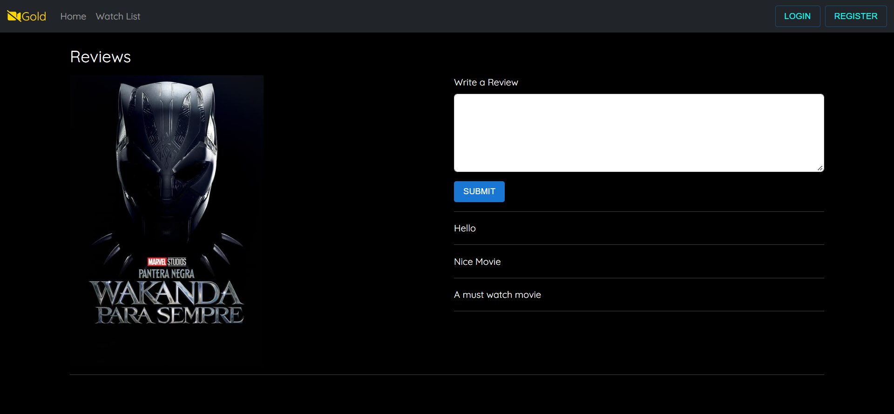

# Movies-Review-Website
In this website, users can scroll through various movies in a carousel and watch their trailers. Users can also post reviews for a movie and can also view reviews posted by other users as well.

## FRONTEND TECHNOLOGIES USED.  
---
- ReactJS
- react-bootstrap
- react-material-ui
  
## BACKEND TECHNOLOGIES USED.  
---
- Spring boot
- Mongodb
- REST APIs


## SETUP REQUIREMENTS.  
 ---
- Copy the github repository url
- Clone to your computer
- Open terminal and navigate to the frontend directory of the project
- Run the following command to install all the dependencies
 ```
npm install
```

## SCREENSHOTS OF THE APPLICATION.

- Home Page
  
  

- YouTube Trailer Page
  
  

- Reviews Page
  
  
  

## AUTHOR  
---

- [Ritwik Kundu](https://github.com/rick-12)

## COPYRIGHT.  
--- 
